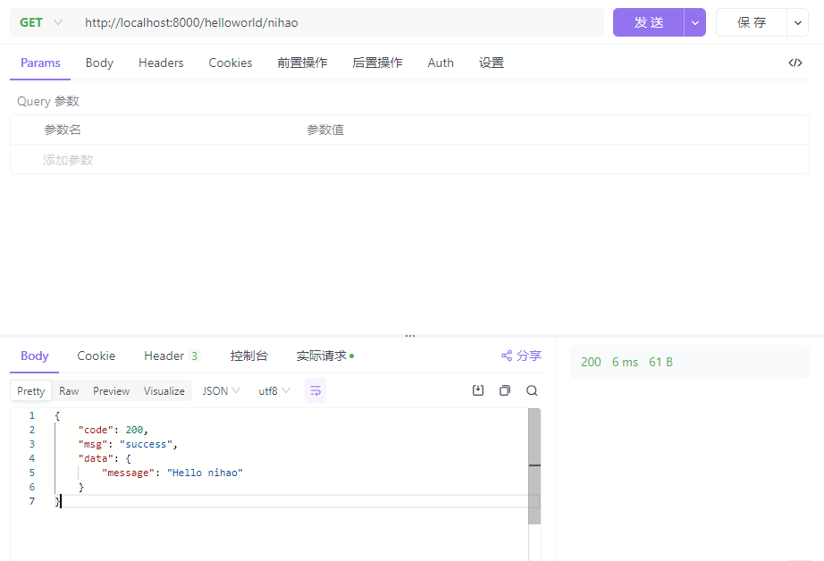
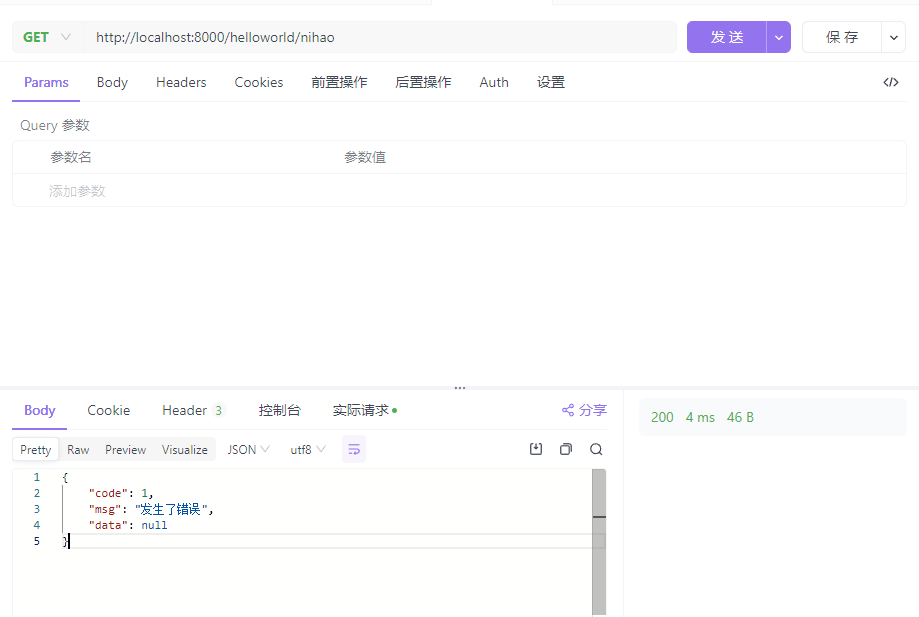

# kratos-go

## 集成 asynq 作为消息队列

[README.md](internal%2Fserver%2FREADME.md)

## dtm 事务管理

[README_dtm.md](doc%2FREADME_dtm.md)

## 根据proto文件输出swagger

[README_swagger.md](doc%2FREADME_swagger.md)

## 自定义响应方式

官方文档：https://go-kratos.dev/docs/component/transport/http

[common](common) 通用模块

### 实现效果

- 成功响应
- 

- 错误响应
- 

### 1. 定义响应结构体

```go
type HttpResponse struct {
    Code int         `json:"code"`
    Msg  string      `json:"msg"`
    Data interface{} `json:"data"`
}
```

### 2. 定义响应函数

```go
// EncoderResponse encode response to the HTTP response.
func EncoderResponse() http.EncodeResponseFunc {
	return func(w http.ResponseWriter, r *http.Request, i interface{}) (err error) {
		if i == nil {
			return nil
		}

		// 自定义响应
		resp := &HttpResponse{
			Code: httpnet.StatusOK,
			Msg:  "success",
			Data: i,
		}

		codec := encoding.GetCodec("json")
		marshal, err := codec.Marshal(resp)
		if err != nil {
			return errors.InternalServer("json", err.Error())
		}
		w.Header().Set("Content-Type", "application/json")

		_, err = w.Write(marshal)
		if err != nil {
			return errors.InternalServer("json", err.Error())
		}

		return nil
	}
}
```

### 3. 注册响应函数

[http.go](internal%2Fserver%2Fhttp.go)

```go
opts = append(opts, http.ResponseEncoder(common.EncoderResponse()))
```

### 4. 定义错误响应函数

```go
// EncoderError encode error to the HTTP response.
func EncoderError() http.EncodeErrorFunc {
	return func(w http.ResponseWriter, r *http.Request, err error) {
		se := errors.FromError(err)

		resp := &HttpResponse{
			Code: int(se.Code),
			Msg:  se.Message,
			Data: nil,
		}

		// 自定义响应
		codec := encoding.GetCodec("json")
		marshal, err := codec.Marshal(resp)
		if err != nil {
			w.WriteHeader(httpnet.StatusInternalServerError)
			return
		}

		w.Header().Set("Content-Type", "application/json")
		w.Write(marshal)

		return
	}
}
```

### 5. 注册错误响应函数

```go
opts = append(opts, http.ErrorEncoder(common.EncoderError()))
```