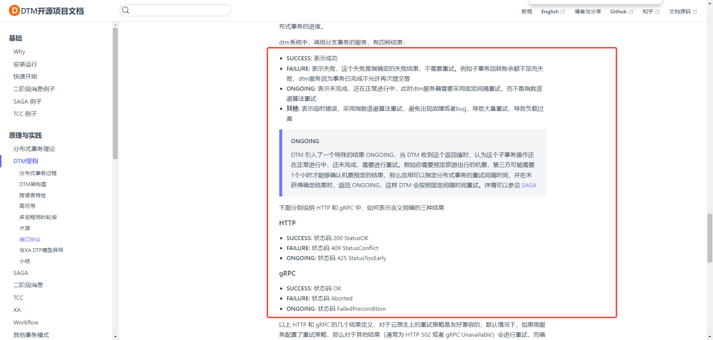

# dtm分布式事务实践

## 接口协议

https://dtm.pub/practice/arch.html#proto



## 实现

[greeter.go](..%2Fapp%2Fstock%2Finternal%2Fservice%2Fgreeter.go)

## kratos状态码转换

以下是kratos做的状态码转化,根据dtm的定义

gRPC#

SUCCESS: 状态码 OK // 通过

FAILURE: 状态码 Aborted // 不重试错误

ONGOING: 状态码 FailedPrecondition // 重试

可以看到grpc相关状态都返回成http code了，所以我们可以直接使用http code来做状态码转换

HTTP#

SUCCESS: 状态码 200 StatusOK // 通过

FAILURE: 状态码 409 StatusConflict // 不重试错误

ONGOING: 状态码 425 StatusTooEarly // 重试


[你的目录....]/go/pkg/mod/github.com/go-kratos/kratos/v2@v2.7.2/transport/http/status/status.go

```go
// ToGRPCCode converts an HTTP error code into the corresponding gRPC response status.
// See: https://github.com/googleapis/googleapis/blob/master/google/rpc/code.proto
func (c statusConverter) ToGRPCCode(code int) codes.Code {
	switch code {
	case http.StatusOK:
		return codes.OK
	case http.StatusBadRequest:
		return codes.InvalidArgument
	case http.StatusUnauthorized:
		return codes.Unauthenticated
	case http.StatusForbidden:
		return codes.PermissionDenied
	case http.StatusNotFound:
		return codes.NotFound
	case http.StatusConflict:
		return codes.Aborted
	case http.StatusTooManyRequests:
		return codes.ResourceExhausted
	case http.StatusInternalServerError:
		return codes.Internal
	case http.StatusNotImplemented:
		return codes.Unimplemented
	case http.StatusServiceUnavailable:
		return codes.Unavailable
	case http.StatusGatewayTimeout:
		return codes.DeadlineExceeded
	case ClientClosed:
		return codes.Canceled
	}
	return codes.Unknown
}

// FromGRPCCode converts a gRPC error code into the corresponding HTTP response status.
// See: https://github.com/googleapis/googleapis/blob/master/google/rpc/code.proto
func (c statusConverter) FromGRPCCode(code codes.Code) int {
	switch code {
	case codes.OK:
		return http.StatusOK
	case codes.Canceled:
		return ClientClosed
	case codes.Unknown:
		return http.StatusInternalServerError
	case codes.InvalidArgument:
		return http.StatusBadRequest
	case codes.DeadlineExceeded:
		return http.StatusGatewayTimeout
	case codes.NotFound:
		return http.StatusNotFound
	case codes.AlreadyExists:
		return http.StatusConflict
	case codes.PermissionDenied:
		return http.StatusForbidden
	case codes.Unauthenticated:
		return http.StatusUnauthorized
	case codes.ResourceExhausted:
		return http.StatusTooManyRequests
	case codes.FailedPrecondition:
		return http.StatusBadRequest
	case codes.Aborted:
		return http.StatusConflict
	case codes.OutOfRange:
		return http.StatusBadRequest
	case codes.Unimplemented:
		return http.StatusNotImplemented
	case codes.Internal:
		return http.StatusInternalServerError
	case codes.Unavailable:
		return http.StatusServiceUnavailable
	case codes.DataLoss:
		return http.StatusInternalServerError
	}
	return http.StatusInternalServerError
}
```